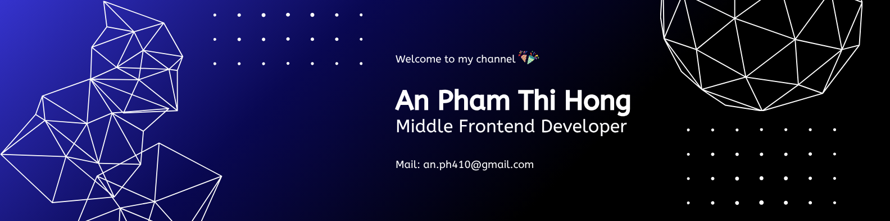

<h1 align="center">👋 Hi there, I'm An</h1>

  🚀 Frontend Developer | 🎨 UI/UX Lover | 🌱 Learning Backend  

### 👨‍💻 About Me

Hey there!
I'm **An** – a Frontend Developer who enjoys “pixel perfection” and having friendly arguments with Figma.  
I love clean interfaces, smooth user interactions, and writing code that others (and future me) can actually understand.

Currently, I'm expanding my skill set into **backend development** using **Node.js + MongoDB**. My goal is to become a well-rounded **full-stack developer** – one who can build beautiful interfaces _and_ wire them up to solid logic behind the scenes.

> I don’t believe in “perfect code” — but I do believe in writing better code than I did yesterday.

- 📫 Contact me: [an.ph410@gmail.com](mailto:an.ph410@gmail.com)
- 📞 **Phone:** +84 343 951 002
- 🔗 **LinkedIn:** [linkedin.com/in/AnPTH](https://www.linkedin.com/in/an-pham-63b618205/)

---

### 🚀 Career Goals

- ✅ Grow into a **Fullstack Developer** with strong frontend roots and solid backend knowledge
- 🔨 Build real-world applications with clean architecture and reusable components
- 🤝 Contribute to a collaborative team where I can share knowledge, learn from others, and continuously improve
- 🌍 Work in an environment that values good UI/UX, clean code, and mentorship
- 📈 Take on more responsibility in projects — from architecture decisions to mentoring junior developers
- 🧭 Open to opportunities in Ho Chi Minh City or remote positions that challenge and inspire growth

---

### ⚡ Fun Facts

- I'm learning backend by building my own API for an online shoe store
- The harder the challenge, the more motivated I get
- Sometimes, refactoring code is more fun than watching movies 🍿
- Whenever I'm stressed, I like to make friends with indoor plants 🌿

### 🛠️ My Tech Stack

**Languages**  

**Frameworks & Libraries**  

**Build Tools**  

**State Management**  

**UI/CSS Frameworks**  

**Version Control**  

**APIs & Server Side**  

**Security (Client-side)**  
🛡️ CORS / CSRF / JWT

---

## 🚀 Featured Projects

| Project                                                                         | Description                                    | Tech              |
| ------------------------------------------------------------------------------- | ---------------------------------------------- | ----------------- |
| [👟 Lookbook Shoes](https://github.com/yourusername/lookbook-shoes)             | Elegant UI for showcasing shoe collections     | React, SCSS       |
| [🛒 Modern eCommerce](https://github.com/yourusername/ecommerce-store)          | Full-featured online store frontend            | React, Tailwind   |
| [⚙️ Reusable UI Components](https://github.com/yourusername/ui-kit)             | Button, Modal, Input with full variant support | React, TypeScript |
| [📦 Backend API Practice](https://github.com/yourusername/backend-api-practice) | Learning Express & MongoDB by building an API  | Node.js, Express  |

---

## 📊 GitHub Stats

  
  

---

## 🔗 Let's Connect!

  

---
